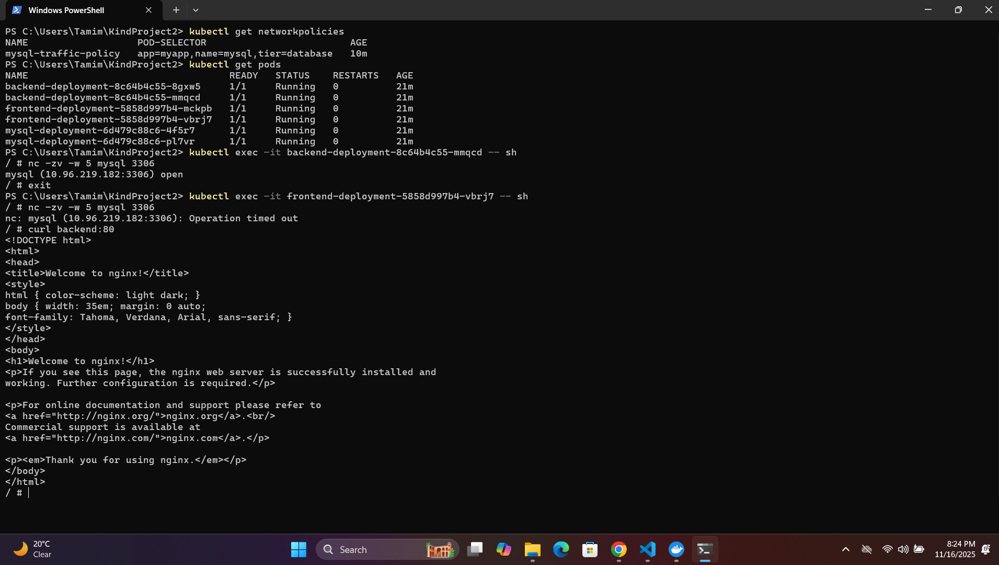
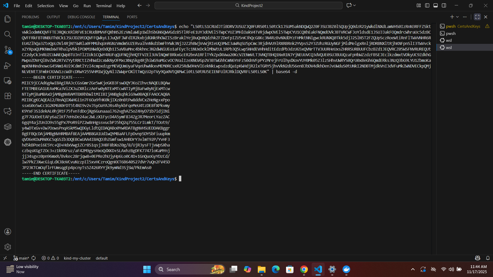
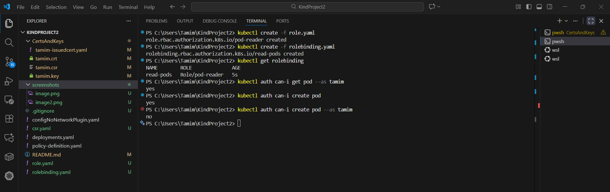
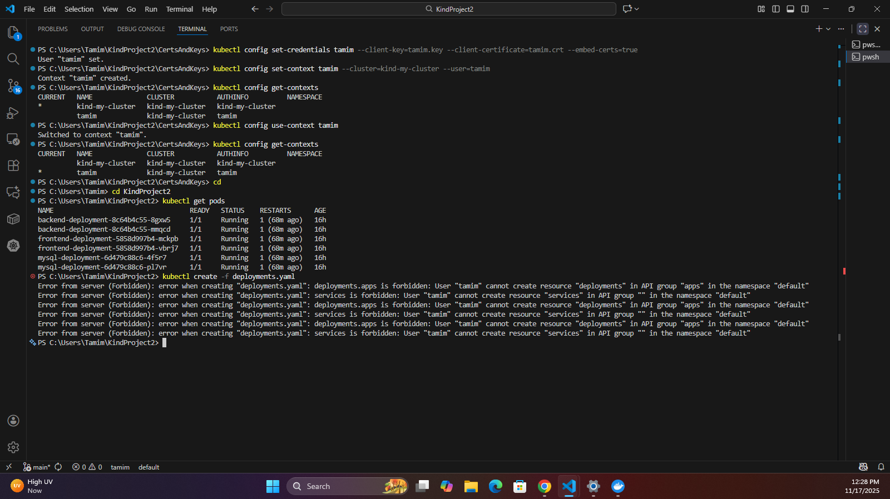

# Kubernetes Zero-Trust Lab: Network Policy + mTLS Auth + RBAC with Real Workloads

**Environment**: Kind (Kubernetes IN Docker)
**Objective**: Deploy a secure multi-tier app, enforce network policies, and configure certificate-based user access.

## Prerequisites

- `Docker`
- `kind`
- `kubectl`
- `openssl`
- `nc` (netcat. It is already added in nginx:alpine)

## 1. Create Kind Cluster (No Default CNI)

```bash
kind create cluster --name my-cluster --config configNoNetworkPlugin.yaml
kubectl apply -f https://github.com/weaveworks/weave/releases/download/v2.8.1/weave-daemonset-k8s.yaml
kubectl create -f deployments.yaml
```
This creates a 3-node cluster (1 control plane, 2 workers), no default CNI, enables pod-to-pod networking using Weave Net and creates 6 deployments (2 frontend, 2 backend and 2 mysql) and services for these pods.

## 2. Enforce Network Security

The main purpose of this step is to prevent any request originating from other than frontend to mysql pod is denied.
```bash
kubectl create -f policy-definition.yaml
```
After creating the Network Policy, 
```bash
kubectl exec -it "Pod Name" -- sh
curl "Pod Name":80
nc -zv mysql 3306
```
These commands will be used to open an interactive shell inside a specified pod, `curl` can be used to check connection between backend and frontend and `nc` will be used to test connection with mysql pods.

Creating the Network Policy is preventing any request originating from other than backend to mysql pod is denied.

## 3. Certificate-Based Authentication

```bash
openssl genrsa -out tamim.key 2048
openssl req -new -key tamim.key -out tamim.csr -subj "/CN=tamim"
cat tamim.csr | base64 | tr -d "\n"
```
A new user will use these commands to generate a new key, a `CSR` using that key, then encode the csr that will be sent to the admin.

```bash
kubectl apply -f csr.yaml
kubectl get csr
kubectl certificate approve tamim
kubectl get csr tamim -o yaml > tamim-issuedcert.yaml
```
```yaml
# csr.yaml
apiVersion: certificates.k8s.io/v1
kind: CertificateSigningRequest
metadata:
  name: tamim
spec: 
  request: <PASTE_BASE64_CSR_HERE>
  signerName: kubernetes.io/kube-apiserver-client
  expirationSeconds: 31536000 # 1 year
  usages:
    - client auth
```
The admin will place the encoded csr in the csr.yaml and create the csr in the cluster that can be viewed using the `kubectl get csr` command. The certificate request is then approved and a certificate is created which is placed into the yaml.

```yaml
# tamim-issuedcert.yaml
# Sample signatured certificate yaml file
apiVersion: certificates.k8s.io/v1
kind: CertificateSigningRequest
metadata:
  annotations:
    kubectl.kubernetes.io/last-applied-configuration: |
      {"apiVersion":"certificates.k8s.io/v1","kind":"CertificateSigningRequest","metadata":{"annotations":{},"name":"tamim"},"spec":{"expirationSeconds":31536000,"request":"LS0tLS1CRUdJTiBDRVJUSUZJQ0FURSBSRVFVRVNULS0tLS0NCk1JSUNWVENDQVQwQ0FRQXdFREVPTUF3R0ExVUVBd3dGZEdGdGFXMHdnZ0VpTUEwR0NTcUdTSWIzRFFFQkFRVUENCkE0SUJEd0F3Z2dFS0FvSUJBUUNMYjlHY0JBaGRZY2FMV2ZzWG81cjE4Y3JTU01oZlBTY0cwL0R4MTFVTEZrZDQNCjJEN0UrbWl5ekViU2puQUp6VWJZb3pwZlNzTlBtM2cwajIvYThsTEk1cGdBbEd6aUhLUnNXcDR4NVRpM01NVHgNCjljK1MrYklyMWpFWGRJaDE2UUF2U0dORzBYdmwrK2ROME9pTmVEb2E2ZHBwcUx2cmErQ0VCbm1obmdmSVB2VnYNCnVKMk1nMktEc1hzWlE1NFMwQVhMcHBtVXAvdDRld043YmhwelpZdk5mVVhKd1BnRG5LWVh3bmhtQWxIc3g2aXMNCnRock5rQUxxQ3BqaHFObFNjZzcyem5tQS9IcytoSDJJOW5iRHljZUN5eSs1eHM4bm1GRGFydm5rc0tzZ3VhUlANCjlNNmkzMy9MakFOUEVhLzRQRHM2akN3K2VvQktRem5CQU1iSXVWMjFBZ01CQUFHZ0FEQU5CZ2txaGtpRzl3MEINCkFRc0ZBQU9DQVFFQVU4djlNaWhRQWEvWHl3ckkveHh4aFNUMnY3ajZlYSsrWUhROW9OeU5ZeEFpbWFyWGRldUoNCjc4YUlVUlRuYy9xZXNmSFpZZ21vWnY1L1BObXRPeW1DMDZSMTJwa2ZqZUVoeXBtVk9QUnZpU0N5YnZ5cmtmSUENCndxVzA4QW0rM2NDclplYjNTNkVkWk0wc2JMeUs1b1E5KzVEWkQ3SklrWHlob1UrQ283UGgxQzFONEVLSXl4a20NClVPSENjR2tBaW9ORGlPN1BPbC9iaFNIaXJIWGhEbWIzbVNBcGszVVI5cVEvVnMwSDM3dGxwajFWSTdPdlVLRVoNCnIrOXJwaWFkRG5Mb1RXTnlMYnZ3VDA0b2NBbnROVDFuUjVpcW45NjlRWGlxNUVoRVNZYStJU1lkU0libmsxdUINCjUxRWZxdXhJWVRrNzUwOVF2QzFPN0JvcFQzb3JHYUxPNFE9PQ0KLS0tLS1FTkQgQ0VSVElGSUNBVEUgUkVRVUVTVC0tLS0tDQo=","signerName":"kubernetes.io/kube-apiserver-client","usages":["client auth"]}}
  creationTimestamp: "2025-11-17T05:27:04Z"
  name: tamim
  resourceVersion: "26146"
  uid: af8e8784-9421-4631-869f-f7b1b5be551e
spec:
  expirationSeconds: 31536000
  extra:
    authentication.kubernetes.io/credential-id:
    - X509SHA256=6be8fe8c254221b7a803cdb829c53a3945f352edabd808f805f70b939c31d8e6
  groups:
  - kubeadm:cluster-admins
  - system:authenticated
  request: LS0tLS1CRUdJTiBDRVJUSUZJQ0FURSBSRVFVRVNULS0tLS0NCk1JSUNWVENDQVQwQ0FRQXdFREVPTUF3R0ExVUVBd3dGZEdGdGFXMHdnZ0VpTUEwR0NTcUdTSWIzRFFFQkFRVUENCkE0SUJEd0F3Z2dFS0FvSUJBUUNMYjlHY0JBaGRZY2FMV2ZzWG81cjE4Y3JTU01oZlBTY0cwL0R4MTFVTEZrZDQNCjJEN0UrbWl5ekViU2puQUp6VWJZb3pwZlNzTlBtM2cwajIvYThsTEk1cGdBbEd6aUhLUnNXcDR4NVRpM01NVHgNCjljK1MrYklyMWpFWGRJaDE2UUF2U0dORzBYdmwrK2ROME9pTmVEb2E2ZHBwcUx2cmErQ0VCbm1obmdmSVB2VnYNCnVKMk1nMktEc1hzWlE1NFMwQVhMcHBtVXAvdDRld043YmhwelpZdk5mVVhKd1BnRG5LWVh3bmhtQWxIc3g2aXMNCnRock5rQUxxQ3BqaHFObFNjZzcyem5tQS9IcytoSDJJOW5iRHljZUN5eSs1eHM4bm1GRGFydm5rc0tzZ3VhUlANCjlNNmkzMy9MakFOUEVhLzRQRHM2akN3K2VvQktRem5CQU1iSXVWMjFBZ01CQUFHZ0FEQU5CZ2txaGtpRzl3MEINCkFRc0ZBQU9DQVFFQVU4djlNaWhRQWEvWHl3ckkveHh4aFNUMnY3ajZlYSsrWUhROW9OeU5ZeEFpbWFyWGRldUoNCjc4YUlVUlRuYy9xZXNmSFpZZ21vWnY1L1BObXRPeW1DMDZSMTJwa2ZqZUVoeXBtVk9QUnZpU0N5YnZ5cmtmSUENCndxVzA4QW0rM2NDclplYjNTNkVkWk0wc2JMeUs1b1E5KzVEWkQ3SklrWHlob1UrQ283UGgxQzFONEVLSXl4a20NClVPSENjR2tBaW9ORGlPN1BPbC9iaFNIaXJIWGhEbWIzbVNBcGszVVI5cVEvVnMwSDM3dGxwajFWSTdPdlVLRVoNCnIrOXJwaWFkRG5Mb1RXTnlMYnZ3VDA0b2NBbnROVDFuUjVpcW45NjlRWGlxNUVoRVNZYStJU1lkU0libmsxdUINCjUxRWZxdXhJWVRrNzUwOVF2QzFPN0JvcFQzb3JHYUxPNFE9PQ0KLS0tLS1FTkQgQ0VSVElGSUNBVEUgUkVRVUVTVC0tLS0tDQo=
  signerName: kubernetes.io/kube-apiserver-client
  usages:
  - client auth
  username: kubernetes-admin
status:
  #Certificate is taken from here
  certificate: LS0tLS1CRUdJTiBDRVJUSUZJQ0FURS0tLS0tCk1JSUM5akNDQWQ2Z0F3SUJBZ0lSQUpjQ0dzR21yWkdlNXdLamVHS0IzRnN3RFFZSktvWklodmNOQVFFTEJRQXcKRlRFVE1CRUdBMVVFQXhNS2EzVmlaWEp1WlhSbGN6QWVGdzB5TlRFeE1UY3dOVEl5TWpCYUZ3MHlOakV4TVRjdwpOVEl5TWpCYU1CQXhEakFNQmdOVkJBTVRCWFJoYldsdE1JSUJJakFOQmdrcWhraUc5dzBCQVFFRkFBT0NBUThBCk1JSUJDZ0tDQVFFQWkyL1JuQVFJWFdIR2kxbjdGNk9hOWZISzBraklYejBuQnRQdzhkZFZDeFpIZU5nK3hQcG8Kc3N4RzBvNXdDYzFHMktNNlgwckRUNXQ0Tkk5djJ2SlN5T2FZQUpSczRoeWtiRnFlTWVVNHR6REU4ZlhQa3ZteQpLOVl4RjNTSWRla0FMMGhqUnRGNzVmdm5UZERvalhnNkd1bmFhYWk3NjJ2Z2hBWjVvWjRIeUQ3MWI3aWRqSU5pCmc3RjdHVU9lRXRBRnk2YVpsS2Y3ZUhzRGUyNGFjMldMelgxRnljRDRBNXltRjhKNFpnSlI3TWVvckxZYXpaQUMKNmdxWTRhalpVbklPOXM1NWdQeDdQb1I5aVBaMnc4bkhnc3N2dWNiUEo1aFEycTc1NUxDcklMbWtUL1RPb3Q5Lwp5NHdEVHhHditEdzdPb3dzUG5xQVNrTTV3UURHeUxsZHRRSURBUUFCbzBZd1JEQVRCZ05WSFNVRUREQUtCZ2dyCkJnRUZCUWNEQWpBTUJnTlZIUk1CQWY4RUFqQUFNQjhHQTFVZEl3UVlNQmFBRkxGcER2bnA1RFlTYkZpdXVwa20KcVZENmVLT3VNQTBHQ1NxR1NJYjNEUUVCQ3dVQUE0SUJBUUQzaFpHbWZzdzFBSEJEclkzdmxtVDkyUC9ZdkhGMwpoZDVrQlBvZWk2RTVZYytRRCtIZHhWd2cxWkNyOFMxcXNqSkg4RjhiWG9aMGcvOC9ValIzeXNGVGp2V3BTWGhhCmN6YnFzS0dnVFpPYzMrejFrUlhydXovYUY0Mk05Z3lzSHhvUWRYS0QrU0xBeGh6QmdERks3NzQ3bG9LYU1ZbmoKampKNHNndnowcG45Nm14Ui9CdmtlYzI4cmpxdzgrMEVQUmUyaFVqeUhwNkxvMEM0RCsxR25RdW9HeVlEekNkLwpsdzdQa1pKWHdjR2lxTGRYSjhvVkN2dU56enBJbDV4dkhDenJvUWduS0tUNkI2NDBTMjdkVnI3dVFuMkZWNDVECkpQMjNLVENtT3FmbHJGVW1zcWdFcDRwY255VHM1WjQyNlJZWWprOXltTmQzU2pTVy9Qa0VtQXMwCi0tLS0tRU5EIENFUlRJRklDQVRFLS0tLS0K
  conditions:
  - lastTransitionTime: "2025-11-17T05:27:20Z"
    lastUpdateTime: "2025-11-17T05:27:19Z"
    message: This CSR was approved by kubectl certificate approve.
    reason: KubectlApprove
    status: "True"
    type: Approved
```
```bash
echo "The certificate from the yaml file" | base64 -d
```

The certificate is then taken from the yaml file `certificate:` section, decoded, used to create a certificate, such as `tamim.crt` and shared with the user that will be used to access the cluster.

## 4. RBAC: Role & RoleBinding

```bash
kubectl create -f role.yaml
kubectl create -f rolebinding.yaml
kubectl get rolebinding
kubectl describe rolebinding read-pods "[Role Binding Name]"
```
A Role and RoleBinding is created for the user tamim. RoleBindings can be viewed in detail.

```bash
kubectl auth can-i get pod --as tamim
kubectl auth can-i create pod --as tamim
```

These commands can be used to varify user access. For this demo, the user can not create pods but can see the list of pods.

<!-- "Count All Roles"
```bash
kubectl get roles -A --no-headers | wc -l
```-->
```bash
kubectl config set-credentials tamim --client-key=tamim.key --client-certificate=tamim.crt --embed-certs=true
kubectl config set-context tamim --cluster=kind-my-cluster --user=tamim
```
The credentials for the user `tamim` is added into the local kubeconfig file, embedding the key and signed certificate for secure authentication. Then a context for the user is created.

```bash
kubectl config get-contexts
```
The list of contexts can be seen using this command.

```bash
kubectl config use-context tamim
```
To switch to the user this command can be used. After this, verious commands can be used to check the user capabilities.

